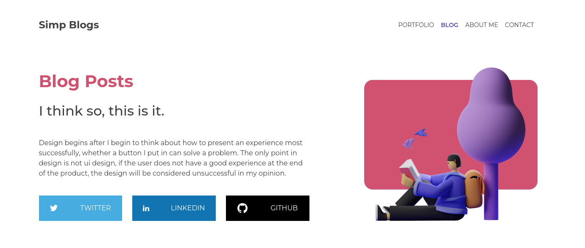
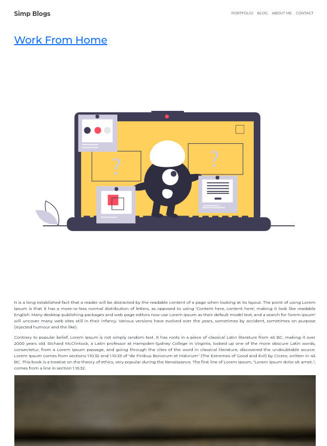
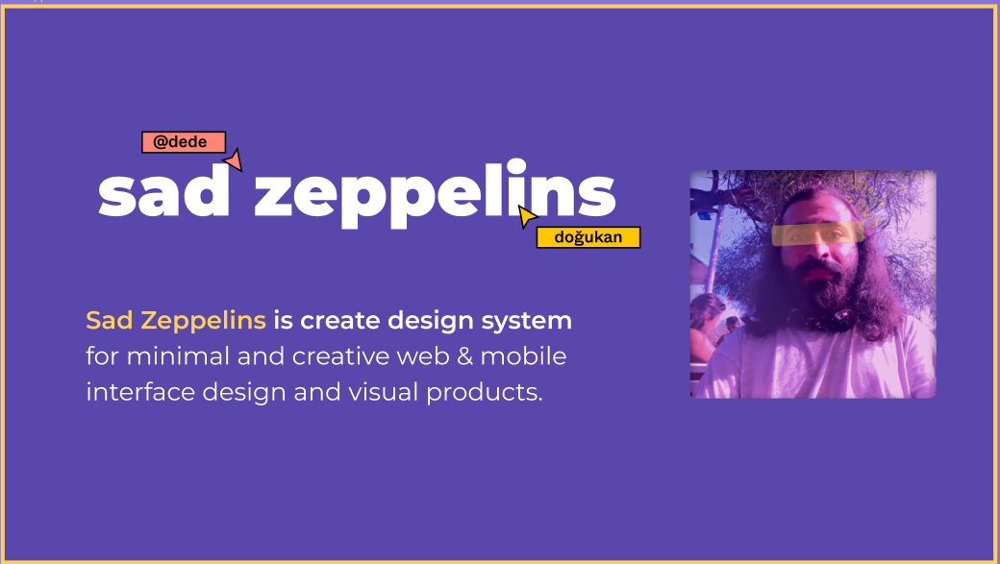

<h1 align="left"> NOTION Simple Blog - FrontEnd </h1>
This project aims to provide views of the notion api:

[Github notion-api](https://github.com/osenbal/notion-api/).

<br />

# Table of Contents

- [Table of Contents](#table-of-contents)
- [Preview Design](#preview-design)
- [Tools Usage](#tools-usage)
- [Installation](#installation)
- [Credits](#credits)

<br />

# Preview Design




# Tools Usage

[](https://www.reactjs.org)
[](https://www.bootstrap.org)

## dependencies

- jquery
- popper.js
- react-router-dom
- emailjs

  <br />

# Installation

**Create file .env on root folder**

```
Add URL root API your notion api (see file .env.example for variable)
Add Emailjs Service key in your .env file (see file .env.example for example variable, just copy and change the value)

notion api backend
: https://github.com/osenbal/notion-api.
```

**Run Your Project**

\*start project

```
npm run start
```

\*build project

```
npm run build
```

<br />

# Credits

very thanks to sad zeppelins for the design which is quite simple and attractive


Design by : sad zeppelins
